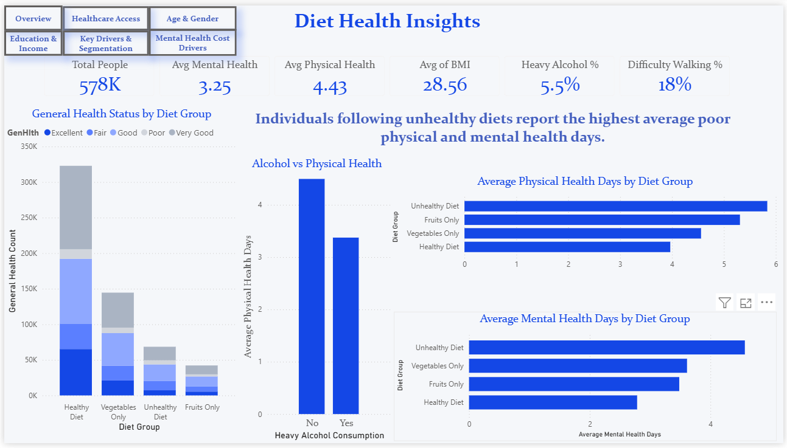
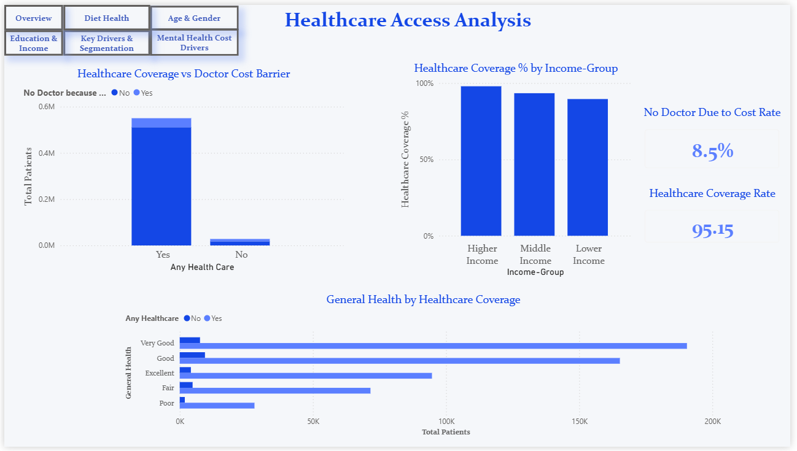
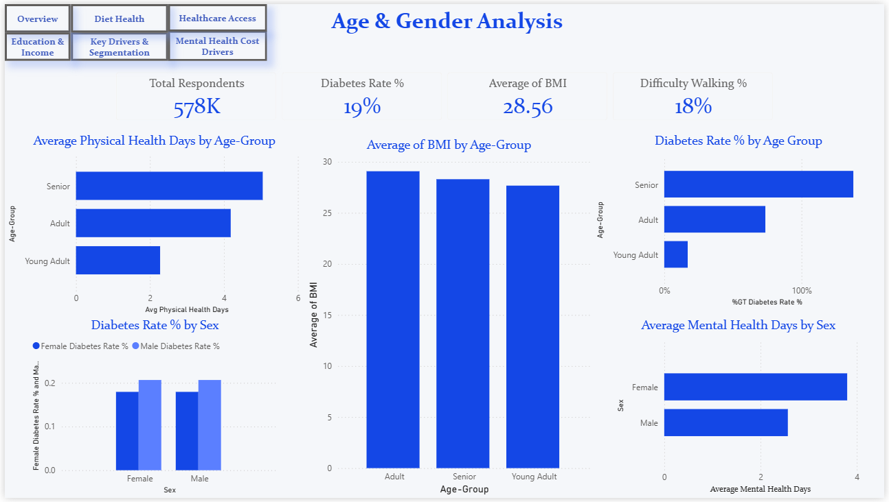
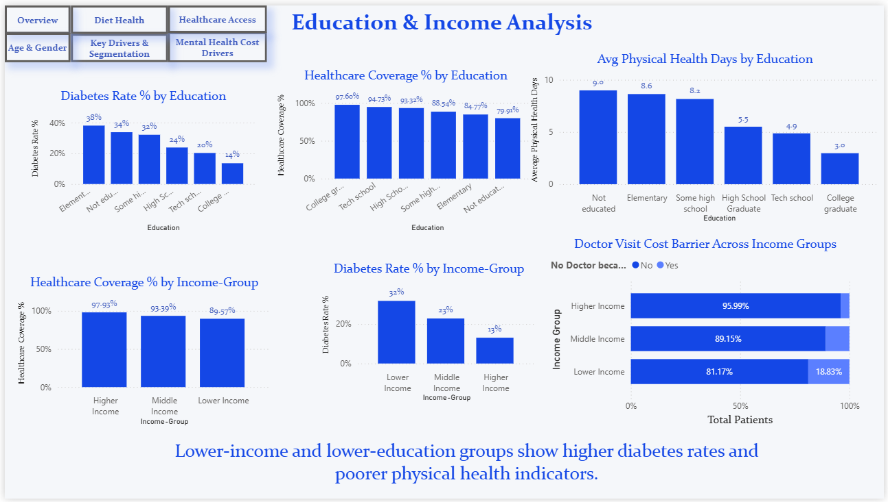
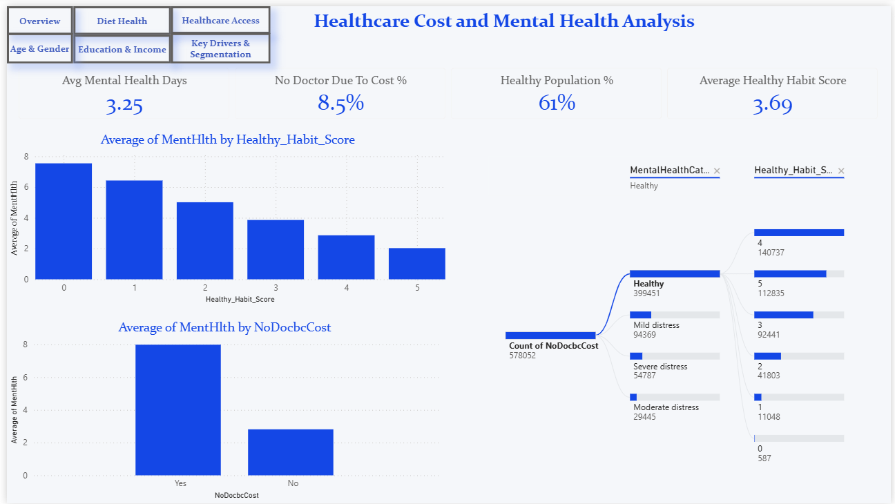

# Diabetes Healthcare Analytics Dashboard | Power BI Project

## Project Overview

This Power BI dashboard analyzes the impact of lifestyle, demographics, healthcare accessibility, education, and income on diabetes-related outcomes. The project aims to uncover patterns and key drivers that influence health indicators and diabetes prevalence.

## Tools & Technologies

* Power BI
* Power Query
* DAX
* Data Modeling
* Data Visualization

## Key Dashboard Pages

### Cover Page

### Diet Health Insights

### Healthcare Access Analysis

### Age & Gender Analysis

### Education & Income Analysis

### Advanced Analytics

### Mental Health & Cost Analysis

## Key Insights

* Lower-income populations show higher diabetes prevalence and lower healthcare coverage.
* Unhealthy diet groups report more physical and mental health challenges.
* Senior age groups exhibit higher diabetes rates and poorer health outcomes.
* Healthcare accessibility is strongly associated with overall health status.
* Physical activity and healthy habits are major positive drivers of health outcomes.

## Project File

The Power BI source file is available in this repository:

**Diabetes Project.pbix.zip**

