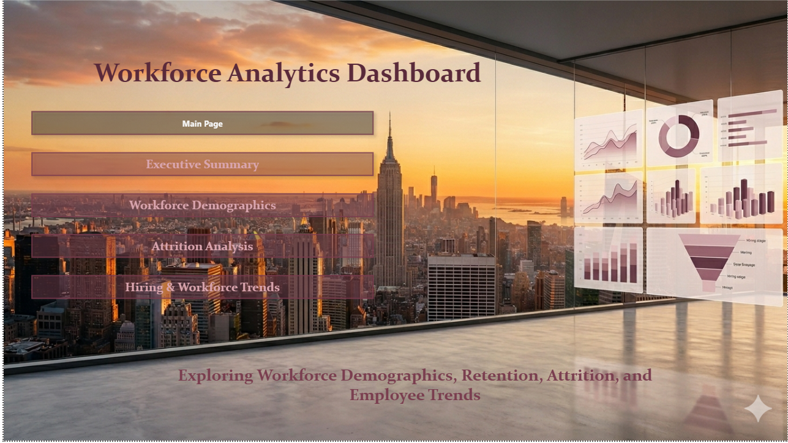
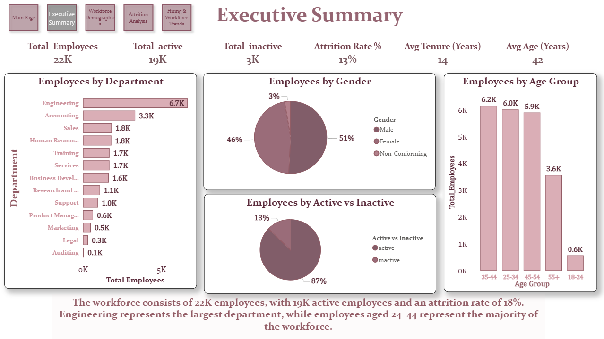
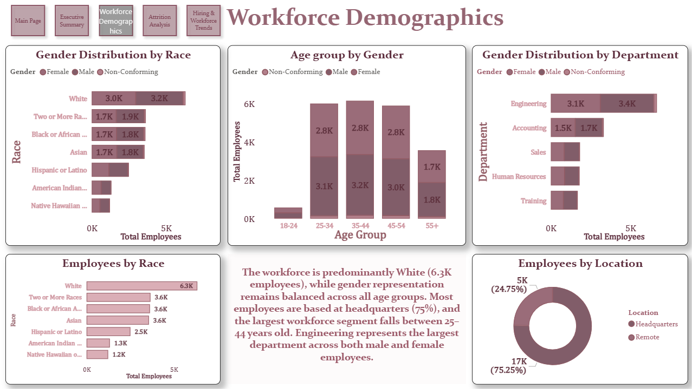
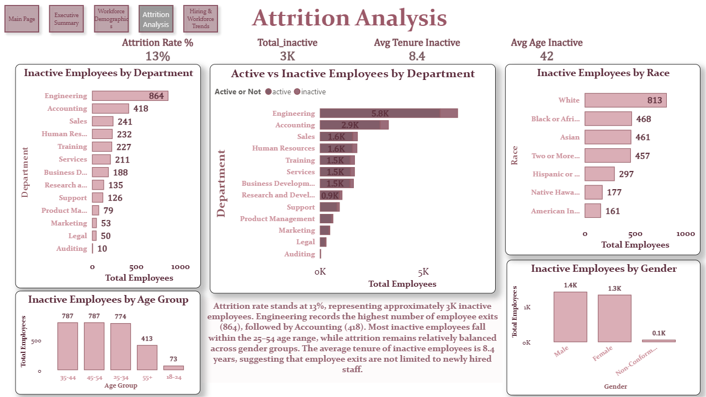
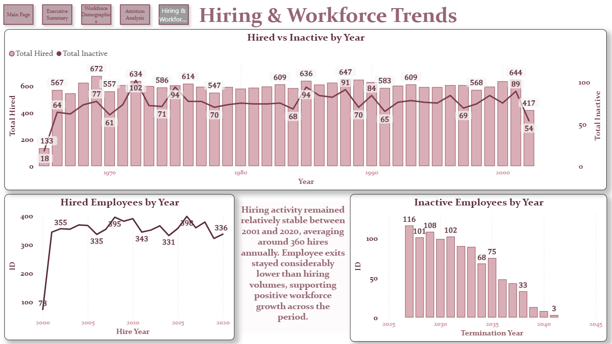

# HR Workforce Analytics Dashboard

## Project Overview

This Power BI dashboard provides comprehensive insights into workforce demographics, employee attrition, and hiring trends. It helps HR teams monitor workforce composition, identify turnover patterns, and evaluate hiring effectiveness.

## Tools Used

- Power BI
- DAX Measures
- Data Modeling
- Data Visualization

## Key KPIs

- Total Employees: 22K
- Active Employees: 19K
- Inactive Employees: 3K
- Attrition Rate: 13%
- Average Tenure: 14 Years
- Average Age: 42 Years

---

## Dashboard Pages

### Main Page

### Executive Summary

### Workforce Demographics

### Attrition Analysis

### Hiring & Workforce Trends

---

## Key Insights

- Engineering is the largest department across the organization.
- Employees aged 25–54 represent the majority of the workforce.
- Attrition remains relatively low at 13%.
- Hiring volumes consistently exceed employee exits, indicating positive workforce growth.
- Workforce demographics remain balanced across departments and age groups.

---

## Files Included

- Hr_Data.pbix
- Dashboard screenshots
- Project documentation

